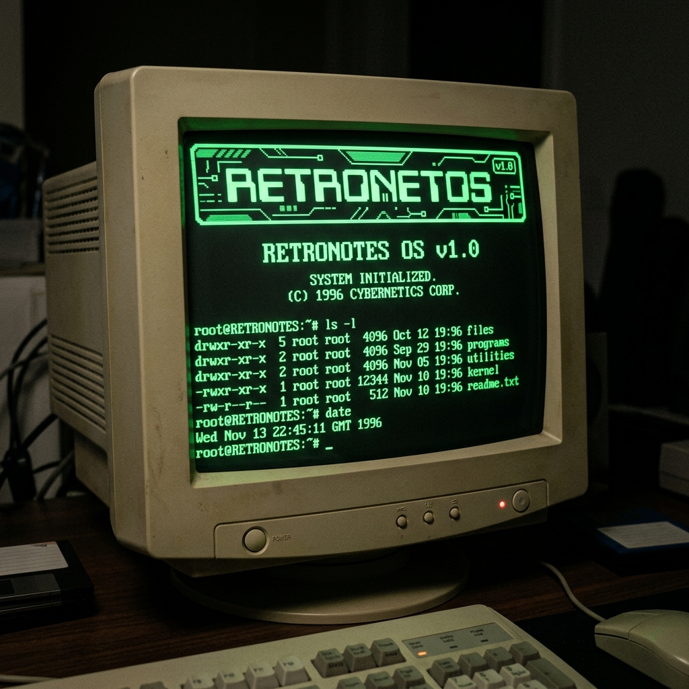

# 📒 RetroNotes



> **"Every thought deserves a page."** — RetroNotes combines nostalgic CRT computing aesthetics with state-of-the-art web technology.

A minimal, high-performance retro-themed note-taking web application featuring CRT monitor phosphor filters, dual-pane Markdown editing, offline synchronization, and an integrated Gemini AI assistant.

---

## 🎨 Retro Touches & Aesthetics

- ⚡ **Startup Boot Animation**: Authentic retro BIOS booting screen with hardware diagnostics and glowing CRT scan lines.
- 🔊 **Typing & Mechanical Sounds**: Optional Web Audio synthesized sound effects (tactile keypress clicks, spacebar clacks, floppy disk saves, toggle beeps).
- 💚 **Cursor Blink**: Glowing phosphor cursor box with blinking animation (`animate-pulse`).
- 👾 **Pixel Icons**: Vintage 8-bit styled retro icons and custom SVGs across the interface.
- 📺 **CRT Scanline & Flicker Toggle**: Curated retro CRT screen filter with adjustable glass curvature, scanline intensity, and toggleable phosphor screen flickers.
- 🎨 **5 Phosphor Display Themes**:
  - 🟢 **Green CRT** (Classic Matrix / IBM Terminal)
  - 🟠 **Amber CRT** (Vintage Monochrome Phosphor)
  - 🏛️ **Win95 Classic** (90s System Desktop Palette)
  - 🔮 **Cyberpunk Neon** (Vibrant Synthetic Retro Glow)
  - ⬛ **Carbon Dark** (Sleek Dark Modern Terminal)

---

## 📝 Note Features & Capabilities

- 📌 **Pin Notes**: Pin critical notes to the top of your deck for instant access.
- ⭐ **Favorite Notes**: Bookmark notes to keep your most valued thoughts handy.
- 🏷️ **Tags System**: Categorize notes using custom tags (`#ideas`, `#coding`, `#study`) to filter lists instantly.
- 📅 **Date Created & Last Edited**: Precise timestamp tracking showing creation and last modified timestamps.
- 📝 **Create Notes**: Dual-pane Markdown editor featuring raw text input on the left and live rendered HTML preview on the right.
- ✏️ **Edit Notes**: Real-time debounced auto-saving, syntax highlighting, list formatting, and inline status indicator.
- 🗑️ **Delete Notes**: Soft-delete notes to a dedicated Trash Can with single-click restoration or permanent purge.
- 📁 **Folder Directories**: Organize notes into custom directories with custom color badges.
- 🧹 **Clean Formatting**: One-click paragraph & whitespace cleanup utility that normalizes extra blank lines and removes trailing spaces.
- 🔍 **Search & AI Search**: Instant keyword search, tag filtering, and natural language Gemini AI search.

---

## 📤 Export & 📥 Import Notes

### 📤 Export Formats & Backups
- 📦 **Export All Notes**: One-click global export button (`EXPORT ALL`) in header to download full JSON backup file (`retronotes_backup_YYYY-MM-DD.json`).
- 🌐 **Backup API (`GET /notes/export/backup`)**: Authenticated server endpoint returning full database backup of user notes, directories, tags, and timestamps.
- 📄 **TXT**: Plain text export with formatted header.
- 📝 **MD**: Standard Markdown file format (`.md`).
- 📋 **JSON**: Structured JSON payload containing title, content, tags, folder, and timestamps.
- 🖨️ **PDF**: Print-ready document layout formatted for PDF archiving.

### 📥 Import Notes
- 📂 **Import `notes.json`**: One-click import tool allowing users to upload `notes.json` files to automatically restore or bulk-create notes in their workspace.

---

## ⌨️ Keyboard Shortcuts

| Shortcut | Action | Description |
| :--- | :--- | :--- |
| `Ctrl + N` | **New Note** | Create a new blank note instantly |
| `Ctrl + S` | **Save Note** | Force immediate save of active note |
| `Ctrl + F` / `Ctrl + K` | **Search** | Open global search & command palette |
| `Ctrl + Shift + F` | **Clean Format** | Clean up extra blank lines and spaces |
| `Ctrl + Shift + E` | **Export Backup** | Export full notebook as JSON backup |
| `Delete` | **Delete Note** | Move active note to Trash Can |
| `Ctrl + P` | **Pin Note** | Toggle pinned status on active note |
| `Ctrl + D` | **Duplicate Note** | Create a clone of the selected note |
| `Ctrl + T` | **Theme Studio** | Open CRT display theme selector |
| `Esc` | **Close Drawers** | Exit drawers, help modals, or search palette |

---

## 📊 Dashboard Statistics

The built-in analytics dashboard gives real-time visibility into your notes system:
- 📊 **Total Notes**: Complete count of active, archived, and trashed notes.
- 📌 **Pinned Notes**: Count of notes currently pinned to top deck.
- ⭐ **Favorites**: Number of bookmarked favorite notes.
- 💾 **Storage Used**: Live calculation of browser `localStorage` capacity utilized in KB/MB.
- 🔥 **Writing Streak**: Daily writing streak tracker with unlockable achievement badges.

---

## 🛠️ Tech Stack

### Frontend (`/client`)
- **Framework**: [Next.js 16](https://nextjs.org/) (App Router) + [React 19](https://react.dev/) + [TypeScript](https://www.typescriptlang.org/)
- **Styling**: [Tailwind CSS v4](https://tailwindcss.com/) + Custom CRT Glass Resets & CSS Variables
- **Authentication**: [NextAuth.js v5](https://authjs.dev/) (Credentials & Google OAuth2)
- **Markdown Processing**: `react-markdown`, `remark-gfm`, `rehype-raw`

### Backend (`/server`)
- **Framework**: [NestJS 11](https://nestjs.com/) (TypeScript Controllers, Modules & Services)
- **Database ORM**: [Prisma ORM v7](https://www.prisma.io/)
- **Database Engine**: [MongoDB Atlas](https://www.mongodb.com/atlas)
- **AI Integration**: [Google Gemini API](https://ai.google.dev/) (`gemini-2.5-flash`)
- **Security**: Passport JWT authentication & bcrypt password hashing

---

## 📂 Folder Structure

```
Retronotes/
├── client/                     # Next.js 16 Frontend Application
│   ├── src/
│   │   ├── app/                # App Router (Pages & API routes)
│   │   │   ├── api/auth/       # NextAuth API endpoints
│   │   │   ├── login/          # Login & Signup forms with CAPTCHA
│   │   │   ├── page.tsx        # Main application landing / dashboard page
│   │   │   ├── layout.tsx      # Root HTML layout with CRT theme scripts
│   │   │   └── globals.css     # Design tokens, CRT resets & animation keyframes
│   │   ├── components/         # Reusable UI components
│   │   │   ├── NotesDashboard.tsx  # Core dual-pane editor & workspace dashboard
│   │   │   ├── Chatbox.tsx         # Global floating Retro-Muse AI chatbox
│   │   │   ├── CassettePlayer.tsx  # Retro cassette ambient music player
│   │   │   └── ThemeGalleryModal.tsx # CRT Monitor theme switcher
│   │   └── lib/                # Utilities, audio engine, and API helpers
│   │       ├── api.ts          # Centralized fetch wrapper with JWT header injection
│   │       └── retroAudio.ts   # Web Audio API sound synthesis engine
│   └── package.json
│
├── server/                     # NestJS 11 Backend API Service
│   ├── prisma/
│   │   ├── schema.prisma       # Prisma MongoDB schema (Users, Notes, Folders, Tags, etc.)
│   │   └── seed.ts             # Database seeder script
│   ├── src/
│   │   ├── ai/                 # Gemini AI integration service & endpoints
│   │   ├── auth/               # Passport JWT authentication service & controllers
│   │   ├── notes/              # Notes CRUD, feed filters, & trash management
│   │   ├── folders/            # Folder directory CRUD service
│   │   ├── tags/               # Tag management & tag-following service
│   │   ├── comments/           # Note comments & thread reply system
│   │   ├── reactions/          # Note reaction counters (Love, Fire, Insightful, Clap)
│   │   ├── follows/            # Author follow/unfollow system
│   │   ├── users/              # User profile stats & achievement tracking
│   │   └── main.ts             # NestJS bootstrap server configuration
│   └── package.json
│
├── retronotes_banner.png       # Project banner graphic
└── README.md                   # System documentation
```

---

## ⚡ Installation Guide

### Prerequisites
- [Node.js](https://nodejs.org/) (v20.0.0 or higher)
- [npm](https://www.npmjs.com/) (v10.0.0 or higher)
- MongoDB Atlas database connection string (or local MongoDB)

### 1. Clone Repository
```bash
git clone https://github.com/ace2920006/Retronotes.git
cd Retronotes
```

### 2. Backend Setup (`/server`)
```bash
cd server
npm install
```

Create a `.env` file inside the `server/` directory:
```env
DATABASE_URL="mongodb+srv://<username>:<password>@cluster.mongodb.net/retronotes?retryWrites=true&w=majority"
JWT_SECRET="retronotes_jwt_secret_key_2026"
PORT=3000
GEMINI_API_KEY="your_google_gemini_api_key"
```

Initialize Prisma schema & seed initial data:
```bash
npx prisma generate
npx prisma db seed
```

Start the NestJS backend server:
```bash
npm run start:dev
```
The backend API will run on `http://localhost:3000`.

### 3. Frontend Setup (`/client`)
Open a new terminal window, navigate to the `client/` directory, and install dependencies:
```bash
cd client
npm install
```

Create a `.env.local` file inside the `client/` directory:
```env
NEXTAUTH_URL="http://localhost:3001"
NEXTAUTH_SECRET="retronotes_nextauth_secret_key_2026"
NEXT_PUBLIC_API_URL="http://localhost:3000"
NEXT_PUBLIC_RECAPTCHA_SITE_KEY="6LeIxAcTAAAAAJcZVRqyHh71UMIEGNQ_MXjiZKhI"
```

Start the Next.js dev server:
```bash
npm run dev -- -p 3001
```
Open [http://localhost:3001](http://localhost:3001) in your browser.

#### Demo Credentials
- **Email**: `test@example.com`
- **Password**: `password`

---

## 🗺️ Roadmap

- [x] 📌 Pin Notes to workspace top
- [x] ⭐ Favorite Notes bookmarking
- [x] 🏷️ Inline Tags & Tag-based filtering
- [x] 📅 Date Created & Last Edited timestamp tracking
- [x] 📁 Folder directories & categorization
- [x] 🔍 Text search & Gemini AI semantic search
- [x] 📝 Dual-pane Markdown editor & preview
- [x] 📤 Export to TXT, MD, JSON, and PDF
- [x] 📥 Import `notes.json` files
- [x] ⌨️ Keyboard Shortcuts (`Ctrl+N`, `Ctrl+S`, `Ctrl+F`, `Delete`)
- [x] 📊 Live Dashboard stats (Total Notes, Pinned, Favorites, Storage Used)
- [x] 🎮 Retro Touches (BIOS boot animation, sound effects, CRT flicker toggle)
- [ ] 🤝 Collaborative real-time note editing rooms (Socket.IO)
- [ ] 🎙️ Ambient Lofi Radio & text-to-speech voice reader
- [ ] ☁️ Direct cloud export (Google Drive & Dropbox integration)

---

## 📄 License

This project is licensed under the **MIT License** — see the [LICENSE](./LICENSE) file for details.
